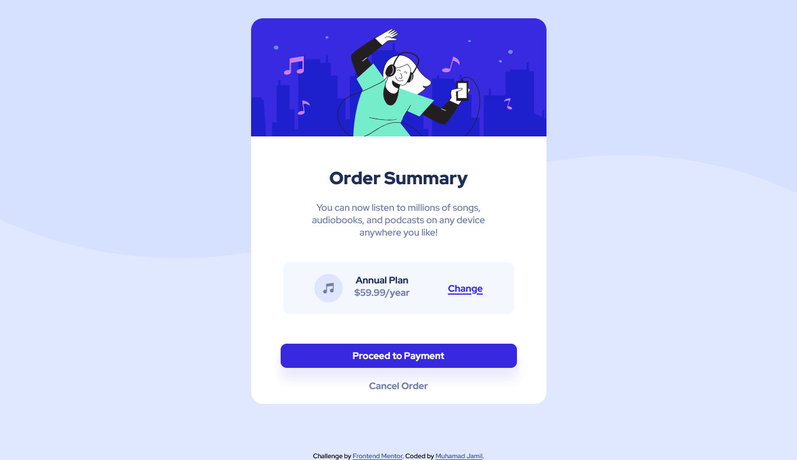

# Frontend Mentor - Order summary card solution

This is a solution to the [Order summary card challenge on Frontend Mentor](https://www.frontendmentor.io/challenges/order-summary-component-QlPmajDUj). Frontend Mentor challenges help you improve your coding skills by building realistic projects. 

## Table of contents

- [Overview](#overview)
  - [The challenge](#the-challenge)
  - [Screenshot](#screenshot)
  - [Links](#links)
- [My process](#my-process)
  - [Built with](#built-with)
  - [What I learned](#what-i-learned)
  - [Continued development](#continued-development)
- [Author](#author)

## Overview

### The challenge

Users should be able to:

- See hover states for interactive elements

### Screenshot

### Links

- Solution URL: [https://www.frontendmentor.io/solutions/responsive-order-summary-card](https://www.frontendmentor.io/solutions/responsive-order-summary-card-XxX9-S5dw)
- Live Site URL: [http://fanreza.me/Front-End-Mentor-Challange-Order-Summary/](http://fanreza.me/Front-End-Mentor-Challange-Order-Summary/)

## My process

### Built with

- CSS custom properties
- Flexbox

### What I learned

I learned a lot about flexbox and svg

### Continued development

The next development is to adapt the nuxt.js framework

## Author

- Website - [fanreza.me](https://fanreza.me/)
- Frontend Mentor - [@Fanreza](https://www.frontendmentor.io/profile/Fanreza)

